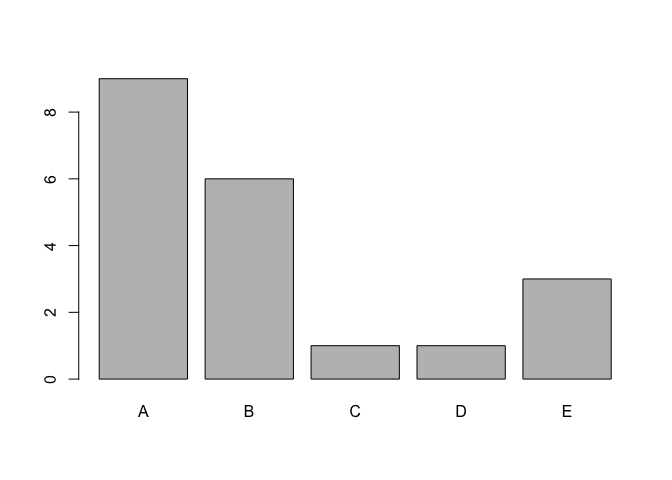

### Introduction

Using fitness devices, a group of people participated in a study that
took measurements to see whether it is possible to calculate how well
they do a particular exercise. The participants in the study were asked
to perform barbell lifts correctly and incorrectly in 5 different ways.
This report uses machine learning methods to identify the categories (A,
B, C, D, and E) of the barbell lifting method.

### Data Reading and Preprocessing

The first step is to read the data into R. The data we're using in this
project consists of two datasets, a training and a testing dataset.

    train_data_orig <- read.table('./pml-training.csv',sep=',',header=T)
    test_data_orig <- read.table('./pml-testing.csv',sep=',',header=T)

The training dataset is a data frame with 19622 rows and 160 columns.
The test dataset has 20 rows and also 160 columns. The last column
("classe") in the training dataset contains the lifting categories, Plot
1 shows us how many cases there are of each category.

    barplot(table(train_data_orig$classe))

The remaining columns in the data represents different measurements,
which will be used to fit a model so we can predict the classification
in the test data. However, not all the columns are appropriate for use
in the model. The first seven columns contains information about the
participants and time, other columns contain mostly missing values, and
others are factor variables that can not be used for prediction in this
case. Let's eliminate columns 1-7 as well as columns that contain more
than 50% NAs. After doing that we will elimate the factor columns,
because in the factor variables in this data will not help in the model.

    na_cols <- which(apply(train_data_orig,2,function(x){length(which(is.na(x)))})>(0.5*ncol(train_data_orig)))
    train_data <- train_data_orig[,-c(1:7,na_cols)]
    test_data <- test_data_orig[,-c(1:7,na_cols)]

    cl <- c()
    for (i in 1:(ncol(train_data)-1)){
      cl <- c(cl,class(train_data[,i]))
    } 
    factor_cols <- which(cl=="factor")
    train_data <- train_data[,-factor_cols]
    test_data <- test_data[,-factor_cols]

We now have 53 columns left, one of them being the "classe" column,
which is what we want to predict. The test data doesn't contain the
"classe" column, so we have to divide the training data into a smaller
training set and an evaluation set, so we can see how well our model
does before using it to predict the "classe" category in the test data.
We will use the "createDataPartition" function from the caret package.

    library(caret)

    ## Warning: package 'caret' was built under R version 3.4.3

    ## Loading required package: lattice

    ## Loading required package: ggplot2

    ## Warning in as.POSIXlt.POSIXct(Sys.time()): unknown timezone 'zone/tz/2018c.
    ## 1.0/zoneinfo/America/Chicago'

    inTrain <- createDataPartition(y=train_data$classe, p=0.60, list=FALSE)
    train  <- train_data[inTrain,]
    eval  <- train_data[-inTrain,]

53 columns is probably too many to be useful in a model. One way to
reduce them is by using principal components and only use the first few,
here we will use the first 10, that will most likely be plenty to
capture the variance in the data.

    preProc <- preProcess(train[,-53],method="pca",pcaComp=10)  # Find the first 10 PCs
    trainPC <- predict(preProc,train[,-53])                     # Calculate first 10 PCs from training data
    evalPC <- predict(preProc,eval[,-53])                       # Calculate first 10 PCs from eval data
    testPC <- predict(preProc,test_data[,-53])                  # Calculate first 10 PCs from test data

### Build the Model and Evaluate the Accuracy

We can now use the 10 principal components we just calculated to build
the model. For this data we will build a random forest model. After
building the model we can use it to predict the "classe" variable for
the evaluation data and calculate the accuracy of our model using the
confusion matrix.

    library(randomForest)

    ## randomForest 4.6-12

    ## Type rfNews() to see new features/changes/bug fixes.

    ## 
    ## Attaching package: 'randomForest'

    ## The following object is masked from 'package:ggplot2':
    ## 
    ##     margin

    mod <- randomForest(train$classe~.,data=trainPC,ntree=50)
    pred_eval <- predict(mod,evalPC)

    cm <- confusionMatrix(eval$classe,pred_eval)

The confusion matrix shows us that the accuracy is 93.7%, which is
definitely acceptable, so we will use this model for the test data. The
out of sample error of the model is 6.3%, which is very small.

### Results

Using the model we built above, we can predict the outcome for the test
data. Plot 2 shows us the resulting partition of the classes.

    pred_test <- predict(mod,testPC)
    print(pred_test)

    ##  1  2  3  4  5  6  7  8  9 10 11 12 13 14 15 16 17 18 19 20 
    ##  B  A  B  A  A  E  D  A  A  A  A  C  B  A  E  E  A  B  B  B 
    ## Levels: A B C D E

    barplot(table(pred_test))

Although the count in each category is different than in the training
dataset, we can see that the distribution is similar, with the A
category having the highest counts.

### Conclusions

This report went through a machine learning exercise to predict the
category different barbell lifting methods fell into. The random forest
model was fitted with high accuracy and low out of sample error, which
makes us confident that the predictions for the test period are robust.
The distribution of the exercise categories is similar to that of the
training period, which is also reassuring. Although a random forest was
fitted here, it is possible that other types of models can predict the
results with a higher accuracy.
